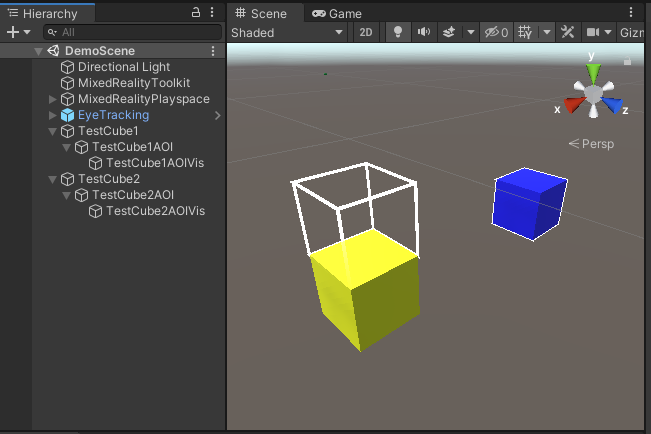

# ARETT Demo

This repository contains a demonstration application for the [Augmented Reality Eye Tracking Toolkit for Head Mounted Displays (ARETT)](https://github.com/AR-Eye-Tracking-Toolkit/ARETT). It integrates the toolkit into a Unity project and serves as an basic example on how to integrate the ARETT functions.

The main purpose is to demonstrate the [control interface](https://github.com/AR-Eye-Tracking-Toolkit/ARETT/wiki/Control-Interface) and all functions of ARETT without the needing to implement an own testing project.

## Dependencies

The project was developed using [Unity 2019.4.20f1](https://unity3d.com/unity/whats-new/2019.4.20) and is set up to include the [Microsoft Mixed Reality Toolkit (MRTK) v2.5.4](https://github.com/microsoft/MixedRealityToolkit-Unity/releases/tag/v2.5.4) to enable support for the Microsoft HoloLens 2.

**Important:** When cloning the project make sure the [ARETT](https://github.com/AR-Eye-Tracking-Toolkit/ARETT) submodule is also cloned into your local copy. If you download the project from GitHub as .zip the ARETT submodule is not included! For the application to work [ARETT](https://github.com/AR-Eye-Tracking-Toolkit/ARETT) needs to be downloaded separately and extracted into the `Assets/ARETT` folder.

After opening the application in the Unity Editor the build target needs to be set to UWP to enable all ARETT functions, even when testing using play mode in the Editor.

## Scene setup

The example scene is purposefully kept minimal and only contains two cubes. One cube has an AOI attached directly to itself, the other cube has an AOI defined above the cube. This shows the possibilities of both an AOI matching an object as well as an AOI defined independent from a visible object.

## Testing in the Unity Editor

All ARETT functions can be tested inside the Unity Editor using the gaze data simulation integrated into ARETT. When the project is set to the UWP build target starting the application in the Editor also starts the control interface and is accessible under [http://127.0.0.1:8080/](http://127.0.0.1:8080/). Interaction with the scene (e.g. moving the camera resulting in simuated gaze data) is enabled by the input simulation of the MRTK.

## Demonstrated ARETT Functions

In general all functions provided by ARETT are demonstrated in this application.

### ARETT Prefab

ARETT is integrated into the project using the [Unity Prefab](https://github.com/AR-Eye-Tracking-Toolkit/ARETT/wiki/Prefab-Overview) provided by the toolkit.

Detailed documentation of all functions provided by the prefab can be found in the [ARETT wiki](https://github.com/AR-Eye-Tracking-Toolkit/ARETT/wiki/Prefab-Overview).

### Configuration

The configuration needed for the toolkit should already be set for this project. However, if there are issues the configuration can be checked and corrected using the [configuration](https://github.com/AR-Eye-Tracking-Toolkit/ARETT/wiki/Configuration) tool of the prefab.

### Data Recording

The project is set up to use real gaze data when running on a HoloLens 2 while simulating gaze data based on the main camera when running in the Unity Editor. Data recording can be tested by starting a recording using the control interface while the application is running either on a HoloLens 2 or inside the Unity Editor.

### AOI Visualization

The application demonstrates AOI highlighting by adding line renderers to the edges to the AOI colliders defined. These line renderers are assigned to the _EyeTrackingVis_ layer and hidden by default.

To show the visualization during development or to check AOI placement the _Show AOI Check_ function in the control interface can be used.

### Accuracy Grid

The accuracy grid provided by the toolkit can be accessed at any time using the control interface while the application is running. Showing it hides all content of the scene with only the accuracy grid being displayed.
